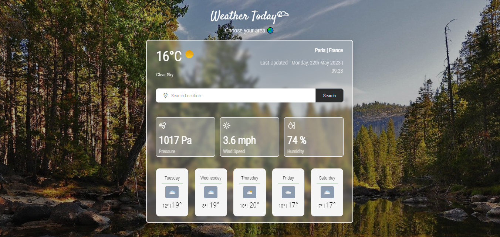

# Visual Appealing Weather Application✨

The combination of HTML, CSS, and JavaScript in this weather app allows for a seamless user experience, where users can easily search for weather information, view it in a visually appealing manner, and stay informed about the weather conditions in their desired locations.

The app has a simple interface with a search bar at the top where the user can enter the name of a city. When the user presses enter, the app will fetch the weather data for that city from an API and display it below the search bar. The weather data includes the current temperature, weather conditions, humidity, and wind speed. Displaying weather icons corresponding to different weather conditions (e.g., sunny, rainy, cloudy) were implemented for updating the UI dynamically.

 

 Here is the result of my Weather App✨

